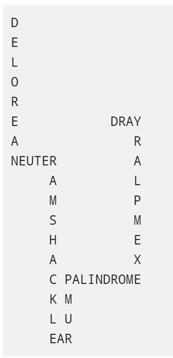

# kafka-wordsnake

- application for creating wordsnakes using kafka and kafka streams:

- wordsnakes are consumed from output topic and written to file on disk

## project structure

*src* - source codes of java application

*utils* - utils scripts for docker kafka-env (create kafka topics, send dummy data, etc.)

*run.sh*  - sets up kafka-env from docker-compose.yml, creates default topics, fill dummy data, builds java app (jar) and simple docker image (using Dockerfile), runs app image and starts processing data from/to default topics